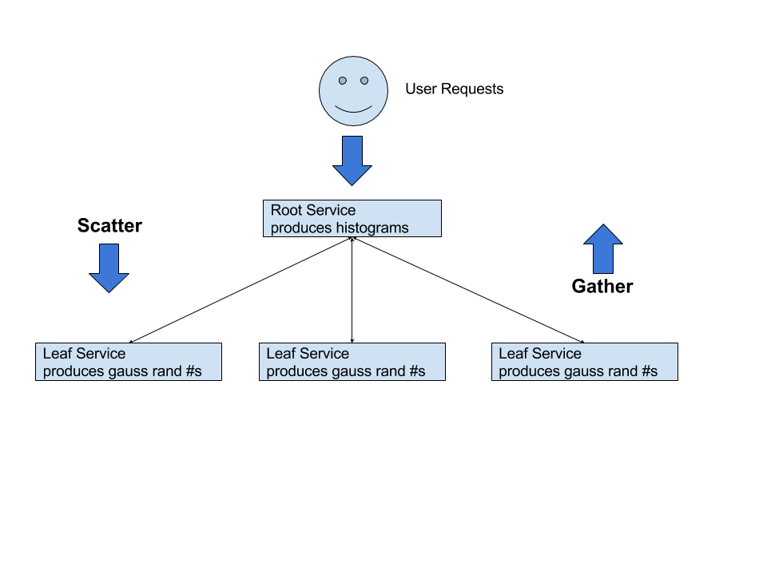

# Metaparticle: Histogram example 

This is a more involved example of a metaparticle service.  This
code-walk assumes that you have already run the initial example and have
metaparticle set up on your system.

The previous example only turned up a single instance of a single service.

Metaparticle is really about (re)using distributed system patterns.

Here is a canonical scatter/gather tree.  Each request that is received
by the root, is sent out to every leaf.  All responses are aggregated on
the root, and the aggregate response is passed back to the caller.



In this particular case, each leaf simply returns 100 random numbers drawn
from a Gaussian distribution.  The root then calculates the histogram
for all of the numbers returned from all leaves and returns this histogram
to the user.  Not necessarily the most useful service, but it clearly
demonstrates the pattern.

## Running the example
```sh
$ node examples histogram.js
```

Try running `docker ps` now, you should see 11 containers running that
implement this scatter gather topology.

To test this histogram, run
```sh
$ node client.js histogram-service
[0,6,40,155,271,312,158,47,10,1]
```

## Looking at the source code
First we just import the metaparticle library.

```js
// Import the main library
var mp = require('../metaparticle');
```

Next we define the function that executes independently on each leaf:
```js
// A simple function for calculating a Gaussian distributed value
// from a uniform random value
var gaussian = function(sigma, mean) {
    var u1 = 2 * Math.PI * Math.random();
    var u2 = -2 * Math.log(Math.random());
    var n = Math.sqrt(u2) * Math.cos(u1);
    return n * sigma + mean;
};

// This function is executed on each leaf
var leafFunction = function(data) {
    var result = { 'n': [] };
    for (var i = 0; i < 100; i++) {
        result.n.push(gaussian(25, 100));
    }
    return result;
};
```

Next we define the function that will aggregate a bunch of different responses
from the leaves into a single histogram:

```js
// This function is executed on each root
var mergeFunction =  function(responses) {
    var histogram = [0, 0, 0, 0, 0, 0, 0, 0, 0, 0];

    for (var i = 0; i < responses.length; i++) {
        for (var j = 0; j < responses[i].n.length; j++) {
            if (responses[i].n < 0 || responses[i].n > 200) {
                continue
            }
            var ix = Math.floor(responses[i].n[j] / 20);
            histogram[ix]++;
        }
    }
    return histogram;
};
```

Finally, we set up the service and start running it.
```js

var svc = mp.service(
    // name of the service
    "histogram-service",
    // library function that creates a scatter/gather service with 10 leaves
    mp.scatter(10, leafFunction, mergeFunction));

// Expose the root service to the world
svc.subservices.gather.expose = true;

// And serve
mp.serve();
```

